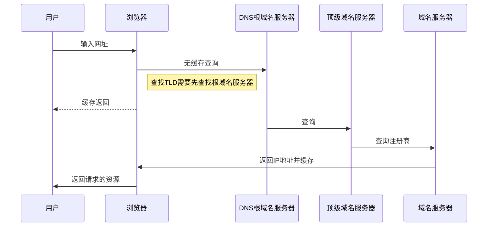

## DNS查询路线

```mermaid
sequenceDiagram
    participant A as 用户
    participant B as 浏览器
    participant C as DNS根域名服务器
    participant D as 顶级域名服务器
    participant E as 域名服务器
    A ->> B: 输入网址
    B ->> C: 无缓存查询
    note right of B: 查找TLD需要先查找根域名服务器
    B -->> A: 缓存返回
    C ->> D: 查询
    D ->> E: 查询注册商
    E ->> B: 返回IP地址并缓存
    B ->> A: 返回请求的资源

```

## DNS动画讲解

https://www.youtube.com/watch?v=3eqEl6scOvw&ab_channel=DNSimple