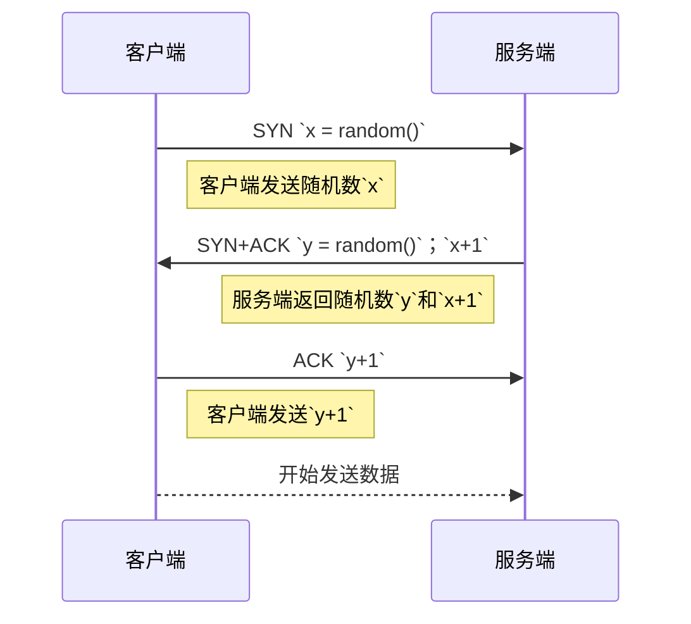

http是基于TCP/IP的应用层通信协议，用于定义客户端和服务器之间的通信规则。

## http/0.9（1991）

http第一个有记录的版本是1991年提出的`http/0.9`，他是有史以来简单的协议。

- 无请求头
- 只支持`GET`方法
- 只能返回`HTML`

```bash
GET /index.html

```

服务器可能返回以下信息

```bash
(res body)
(connection closed)

```

## http/1.0（1996）

- 支持请求头和响应头（包括状态码、缓存、授权、字符集等）
- 额外支持`HEAD`和`POST`方法
- 支持更多的响应格式如视频、文本、图像等

> [!WARNING]
http/1.0的主要缺点之一就是每个连接不能有多个请求。对于任何一个请求，都必须建立在新的连接上，会因为三次握手导致性能浪费。
> 

```bash
GET /index.html HTTP/1.0
Host: jinzhe.cc
Accept: */*

```

服务器可能返回以下信息

```bash
HTTP/1.0 200 OK
Content-Type: text/plain
Server: Apache 0.84

(res body)
(connection closed)

```

## http/1.1（1999）

- 额外添加了`PUT`、`PATCH`、`OPTIONS`、`DELETE`
- 添加了`Connection`请求头，允许客户端和服务器指定连接的选项。
- 管道化，客户端可以在同一连接上向服务器发送多个请求，而无需等待服务器的响应，并且服务器必须按照接收请求的顺序发送响应。客户端必须使用`Content-Length`识别结束位置。
- 分块传输，当服务器无法真正找到`Content-Length`的时候，就会分块传输，并给每一个块加上`Content-Length`，服务器包含标头`Transfer-Encoding: chunked`。

> [!WARNING]
Content-Length并不能完全解决持久连接的问题，假如说数据是动态的，并且服务端无法知道内容长度，那么客户端就无法知道数据何时结束。
队头阻塞
> 

## SPDY（2009）

- 多路复用
- 压缩
- 优先级
- 安全性

SPDY的出现并不是取代HTTP，而是在HTTP发出请求之前对其修改。它开始成为事实上的标准，大多数浏览器开始实现它。到了2015年，Google不想出现两个相互竞争的标准，
所以它决定将SPDY合并到HTTP/2.0中并弃用SPDY。

## http/2.0（2015）

`HTTP/2` 专为低延迟内容传输而设计，

- 二进制，每个`HTTP/2`请求和响应都会被赋予一个唯一的流ID，流是帧的集合，每个帧都包含包含帧类型、流ID、帧长度等信息。
- 多路复用，所有连接的请求和响应都在同一个TCP连接上完成。客户端异步发送，服务端异步响应，按流ID识别。
- `HPACK`头部压缩，使用霍夫曼编码。
- 服务器推送。无需客户端请求，推送给客户端资源。
- 请求优先级，可以更改流的优先级。
- 安全，尽管`HTTP/2`不要求按规范进行加密，但无论如何它在默认情况下已成为强制性。

## 三次握手



http是基于TCP/IP的应用层通信协议，用于定义客户端和服务器之间的通信规则。

## http/0.9（1991）

http第一个有记录的版本是1991年提出的`http/0.9`，他是有史以来简单的协议。

- 无请求头
- 只支持`GET`方法
- 只能返回`HTML`

```bash
GET /index.html

```

服务器可能返回以下信息

```bash
(res body)
(connection closed)

```

## http/1.0（1996）

- 支持请求头和响应头（包括状态码、缓存、授权、字符集等）
- 额外支持`HEAD`和`POST`方法
- 支持更多的响应格式如视频、文本、图像等

> [!WARNING]
http/1.0的主要缺点之一就是每个连接不能有多个请求。对于任何一个请求，都必须建立在新的连接上，会因为三次握手导致性能浪费。
> 

```bash
GET /index.html HTTP/1.0
Host: jinzhe.cc
Accept: */*

```

服务器可能返回以下信息

```bash
HTTP/1.0 200 OK
Content-Type: text/plain
Server: Apache 0.84

(res body)
(connection closed)

```

## http/1.1（1999）

- 额外添加了`PUT`、`PATCH`、`OPTIONS`、`DELETE`
- 添加了`Connection`请求头，允许客户端和服务器指定连接的选项。
- 管道化，客户端可以在同一连接上向服务器发送多个请求，而无需等待服务器的响应，并且服务器必须按照接收请求的顺序发送响应。客户端必须使用`Content-Length`识别结束位置。
- 分块传输，当服务器无法真正找到`Content-Length`的时候，就会分块传输，并给每一个块加上`Content-Length`，服务器包含标头`Transfer-Encoding: chunked`。

> [!WARNING]
Content-Length并不能完全解决持久连接的问题，假如说数据是动态的，并且服务端无法知道内容长度，那么客户端就无法知道数据何时结束。
队头阻塞
> 

## SPDY（2009）

- 多路复用
- 压缩
- 优先级
- 安全性

SPDY的出现并不是取代HTTP，而是在HTTP发出请求之前对其修改。它开始成为事实上的标准，大多数浏览器开始实现它。到了2015年，Google不想出现两个相互竞争的标准，
所以它决定将SPDY合并到HTTP/2.0中并弃用SPDY。

## http/2.0（2015）

`HTTP/2` 专为低延迟内容传输而设计，

- 二进制，每个`HTTP/2`请求和响应都会被赋予一个唯一的流ID，流是帧的集合，每个帧都包含包含帧类型、流ID、帧长度等信息。
- 多路复用，所有连接的请求和响应都在同一个TCP连接上完成。客户端异步发送，服务端异步响应，按流ID识别。
- `HPACK`头部压缩，使用霍夫曼编码。
- 服务器推送。无需客户端请求，推送给客户端资源。
- 请求优先级，可以更改流的优先级。
- 安全，尽管`HTTP/2`不要求按规范进行加密，但无论如何它在默认情况下已成为强制性。

## 三次握手

