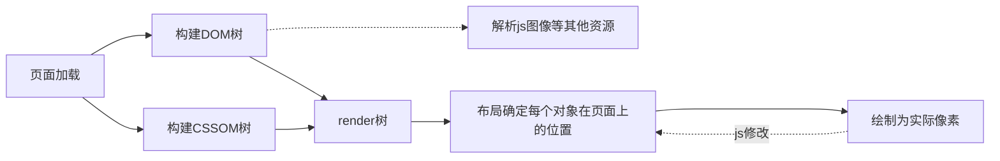

> 解析没有defer或async属性的js时会阻塞DOM的解析
> 

```mermaid
graph LR
    A[页面加载] --> B[构建DOM树] --> D[render树]
    A --> C[构建CSSOM树] --> D
    B -..-> E[解析js图像等其他资源]
    D --> F[布局确定每个对象在页面上的位置] --> G[绘制为实际像素]
    G -....-> |js修改| F

```